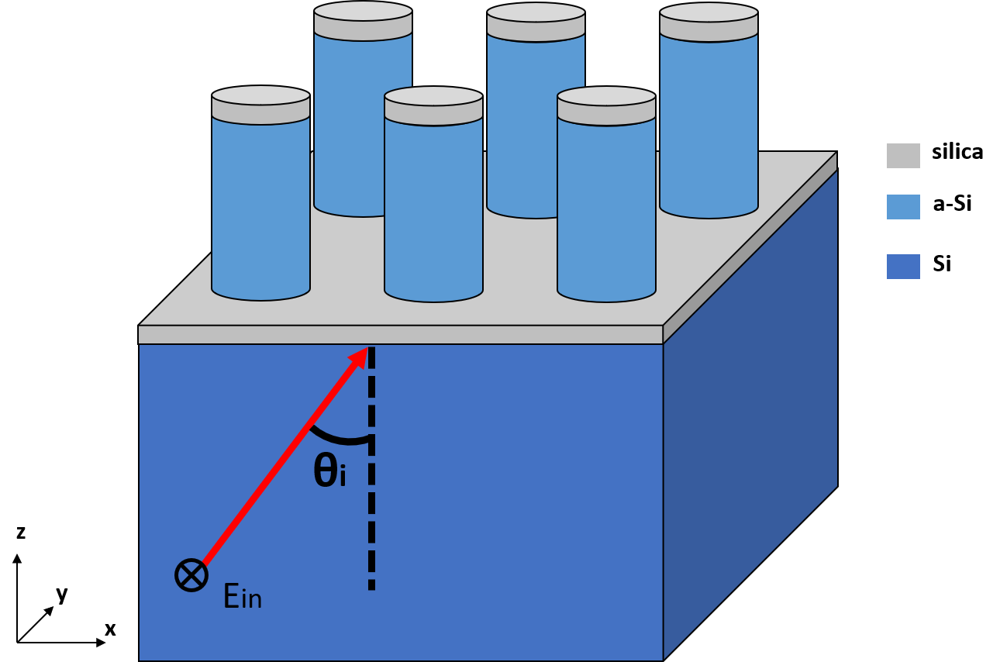

# PY_S4
The project is based on https://github.com/victorliu/S4. The S4 package with python API should be installed first. For the installation guide, please refer to: https://github.com/phoebe-p/S4 by [Dr. Phoebe Pearce] (https://github.com/phoebe-p). The installation becomes very simple by following her steps.
This project is used for the sweep of cylinder-shaped meta-atom library. But it can be modified for other use related RCWA.

## Relevent publicaitons
[Integrated Metasurfaces on Silicon Photonics for Emission Shaping and Holographic Projection](https://arxiv.org/abs/2205.10537)  
Ping-Yen Hsieh, Shun-Lin Fang, Yu-Siang Lin, Wen-Hsien Huang, Jia-Min Shieh, Peichen Yu, and You-Chia Chang  
Nanophotonics 2022 (accepted)  

[Shaping Free-space Emission with Monolithically Integrated Metalenses on Silicon Photonic Waveguides](https://doi.org/10.1364/CLEO_SI.2022.SM4P.7)  
Ping-Yen Hsieh, Yu-Siang Lin, Shun-Lin Fang, and You-Chia Chang  
CLEO 2022, paper SM4P.7.  


***
## Basic usage
The schematic of the simulation model:  

  

### Example
The Example/ contains 2 example scripts. The structure is from  [Nat Commun 6, 7069 (2015)](https://www.nature.com/articles/ncomms8069#citeas) by Amir Arbarbi et al.. Example.py is a simple example that can directly run in IDE.
Or you can use the following method to read the Example.yml. The models are identical.
### To run the sweep
$ python3 atom_sweep.py -i <input_parameters.yml>
### To analysis the data
$ python3 sweepAnalysis.py -i <input_parameters.yml>
***
## atom_sweep.py input parameters
The input argument or the structure can be easily modified. Here is an example of mine.
Sweep of 562nm period meta-atom library with SiO2 hardmask.
All unit in "nm"
```
PY_S4:
        period: 562
        radii_range: [50,250,2]
        height_range: [1000,1500,1]
        wavelength: 1550
        h_mask: 80
        epsilon: 2.08514 # Palik
        top_mask: True
        angle: 54.9467 # effective index of 80nmSiO2 slab on silicon waveguide
        outputPath: "Example/" 
        outputName: "Lib562sweep" # Default output name = outputName_E.txt and outputName_T.txt
```
## Analysis.py input argument
The analysis input argument can be modified. My example here plot the phase and transmission data and output the transmission and phase data.
Unit in "nm"
```
PY_S4_Analysis:
        radii_range: [50,250,2]
        height_range: [500,1500,10]
        logScale: True # Whether to use log scale in transmission or not
        inputFile_T: "Example/Lib562sweep_T.txt"
        inputFile_E: "Example/Lib562sweep_E.txt"
        outputPath: "Example/"
        outputName: "sweep562" # Default output name: sweep562_T.txt and sweep562_Phase.txt
        Data: "2D" # 2D or 1D sweep
```
